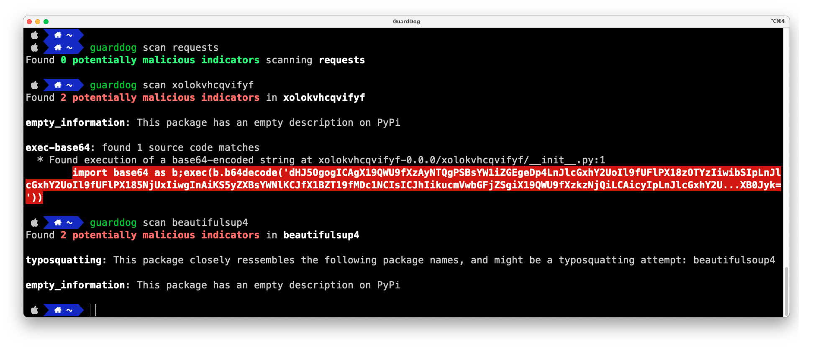

# GuardDog

[](https://github.com/DataDog/guarddog/actions/workflows/test.yml) [](https://github.com/DataDog/guarddog/actions/workflows/semgrep.yml)

<p align="center">
  
</p>

GuardDog is a CLI tool that allows to identify malicious PyPI and npm packages. It runs a set of heuristics on the package source code (through Semgrep rules) and on the package metadata.

GuardDog can be used to scan local or remote PyPI and npm packages using any of the available [heuristics](#heuristics).



## Getting started

### Installation

```sh
pip install guarddog
```

Or use the Docker image:

```sh
docker pull ghcr.io/datadog/guarddog
alias guarddog='docker run --rm ghcr.io/datadog/guarddog'
```

*Note: On Windows, the only supported installation method is Docker.*

### Sample usage

```sh
# Scan the most recent version of the 'requests' package
guarddog pypi scan requests

# Scan a specific version of the 'requests' package
guarddog pypi scan requests --version 2.28.1

# Scan the 'request' package using 2 specific heuristics
guarddog pypi scan requests --rules exec-base64 --rules code-execution

# Scan the 'requests' package using all rules but one
guarddog pypi scan requests --exclude-rules exec-base64

# Scan a local package
guarddog pypi scan /tmp/triage.tar.gz

# Scan a local directory, the packages need to be located in the root directory
# For instance you have several pypi packages in ./samples/ like:
# ./samples/package1.tar.gz ./samples/package2.zip ./samples/package3.whl
# FYI if a file not supported by guarddog is found you will get an error
# Here is the command to scan a directory:
guarddog pypi scan ./samples/

# Scan every package referenced in a requirements.txt file of a local folder
guarddog pypi verify workspace/guarddog/requirements.txt

# Scan every package referenced in a requirements.txt file and output a sarif file - works only for verify
guarddog pypi verify --output-format=sarif workspace/guarddog/requirements.txt

# Output JSON to standard output - works for every command
guarddog pypi scan requests --output-format=json

# All the commands also work on npm
guarddog npm scan express

# Run in debug mode
guarddog --log-level debug npm scan express
```


## Heuristics

GuardDog comes with 2 types of heuristics:

* [**Source code heuristics**](https://github.com/DataDog/guarddog/tree/main/guarddog/analyzer/sourcecode): Semgrep rules running against the package source code.

* [**Package metadata heuristics**](https://github.com/DataDog/guarddog/tree/main/guarddog/analyzer/metadata): Python or Javascript heuristics running against the package metadata on PyPI or npm.

<!-- BEGIN_RULE_LIST -->
### PyPI

Source code heuristics:

| **Heuristic** | **Description** |
|:-------------:|:---------------:|
| shady-links | Identify when a package contains an URL to a domain with a suspicious extension |
| obfuscation | Identify when a package uses a common obfuscation method often used by malware |
| clipboard-access | Identify when a package reads or write data from the clipboard |
| exfiltrate-sensitive-data | Identify when a package reads and exfiltrates sensitive data from the local system |
| download-executable | Identify when a package downloads and makes executable a remote binary |
| exec-base64 | Identify when a package dynamically executes base64-encoded code |
| silent-process-execution | Identify when a package silently executes an executable |
| steganography | Identify when a package retrieves hidden data from an image and executes it |
| code-execution | Identify when an OS command is executed in the setup.py file |
| cmd-overwrite | Identify when the 'install' command is overwritten in setup.py, indicating a piece of code automatically running when the package is installed |

Metadata heuristics:

| **Heuristic** | **Description** |
|:-------------:|:---------------:|
| empty_information | Identify packages with an empty description field |
| release_zero | Identify packages with an release version that's 0.0 or 0.0.0 |
| typosquatting | Identify packages that are named closely to an highly popular package |
| potentially_compromised_email_domain | Identify when a package maintainer e-mail domain (and therefore package manager account) might have been compromised |
| unclaimed_maintainer_email_domain | Identify when a package maintainer e-mail domain (and therefore npm account) is unclaimed and can be registered by an attacker |
| repository_integrity_mismatch | Identify packages with a linked GitHub repository where the package has extra unexpected files |
| single_python_file | Identify packages that have only a single Python file |


### npm

Source code heuristics:

| **Heuristic** | **Description** |
|:-------------:|:---------------:|
| npm-serialize-environment | Identify when a package serializes 'process.env' to exfiltrate environment variables |
| npm-obfuscation | Identify when a package uses a common obfuscation method often used by malware |
| npm-silent-process-execution | Identify when a package silently executes an executable |
| shady-links | Identify when a package contains an URL to a domain with a suspicious extension |
| npm-exec-base64 | Identify when a package dynamically executes code through 'eval' |
| npm-install-script | Identify when a package has a pre or post-install script automatically running commands |
| npm-exfiltrate-sensitive-data | Identify when a package reads and exfiltrates sensitive data from the local system |

Metadata heuristics:

| **Heuristic** | **Description** |
|:-------------:|:---------------:|
| empty_information | Identify packages with an empty description field |
| release_zero | Identify packages with an release version that's 0.0 or 0.0.0 |
| potentially_compromised_email_domain | Identify when a package maintainer e-mail domain (and therefore package manager account) might have been compromised; note that NPM's API may not provide accurate information regarding the maintainer's email, so this detector may cause false positives for NPM packages. see https://www.theregister.com/2022/05/10/security_npm_email/ |
| unclaimed_maintainer_email_domain | Identify when a package maintainer e-mail domain (and therefore npm account) is unclaimed and can be registered by an attacker; note that NPM's API may not provide accurate information regarding the maintainer's email, so this detector may cause false positives for NPM packages. see https://www.theregister.com/2022/05/10/security_npm_email/ |
| typosquatting | Identify packages that are named closely to an highly popular package |
| direct_url_dependency | Identify packages with direct URL dependencies. Dependencies fetched this way are not immutable and can be used to inject untrusted code or reduce the likelihood of a reproducible install. |
| npm_metadata_mismatch | Identify packages which have mismatches between the npm package manifest and the package info for some critical fields |


<!-- END_RULE_LIST -->

## Running GuardDog in a GitHub Action

The easiest way to integrate GuardDog in your CI pipeline is to leverage the SARIF output format, and upload it to GitHub's [code scanning](https://docs.github.com/en/code-security/code-scanning/automatically-scanning-your-code-for-vulnerabilities-and-errors/about-code-scanning) feature.

Using this, you get:
* Automated comments to your pull requests based on the GuardDog scan output
* Built-in false positive management directly in the GitHub UI


Sample GitHub Action using GuardDog:

```yaml
name: GuardDog

on:
  push:
    branches:
      - main
  pull_request:
    branches:
      - main

permissions:
  contents: read

jobs:
  guarddog:
    permissions:
      contents: read # for actions/checkout to fetch code
      security-events: write # for github/codeql-action/upload-sarif to upload SARIF results
    name: Scan dependencies
    runs-on: ubuntu-latest

    steps:
      - uses: actions/checkout@v4

      - name: Set up Python
        uses: actions/setup-python@v5
        with:
          python-version: "3.10"

      - name: Install GuardDog
        run: pip install guarddog

      - run: guarddog pypi verify requirements.txt --output-format sarif --exclude-rules repository_integrity_mismatch > guarddog.sarif

      - name: Upload SARIF file to GitHub
        uses: github/codeql-action/upload-sarif@v3
        with:
          category: guarddog-builtin
          sarif_file: guarddog.sarif
```


## Development

### Running a local version of GuardDog

#### Using pip

* Ensure `>=python3.10` is installed
* Clone the repository
* Create a virtualenv: `python3 -m venv venv && source venv/bin/activate`
* Install requirements: `pip install -r requirements.txt`
* Run GuardDog using `python -m guarddog`

#### Using poetry

* Ensure poetry has an env with `python >=3.10` `poetry env use 3.10.0`
* Install dependencies `poetry install`
* Run guarddog `poetry run guarddog` or `poetry shell` then run `guarddog`

### Unit tests

Running all unit tests: `make test`

Running unit tests against Semgrep rules: `make test-semgrep-rules` (tests are [here](https://github.com/DataDog/guarddog/tree/main/tests/analyzer/sourcecode)). These use the standard methodology for [testing Semgrep rules](https://semgrep.dev/docs/writing-rules/testing-rules/).

Running unit tests against package metadata heuristics: `make test-metadata-rules` (tests are [here](https://github.com/DataDog/guarddog/tree/main/tests/analyzer/metadata)).

### Benchmarking

You can run GuardDog on legitimate and malicious packages to determine false positives and false negatives. See [./tests/samples](./tests/samples)

### Code quality checks

Run the type checker with
```shell
mypy --install-types --non-interactive guarddog
```
and the linter with
```shell
flake8 guarddog --count --select=E9,F63,F7,F82 --show-source --statistics --exclude tests/analyzer/sourcecode,tests/analyzer/metadata/resources,evaluator/data
flake8 guarddog --count --max-line-length=120 --statistics --exclude tests/analyzer/sourcecode,tests/analyzer/metadata/resources,evaluator/data --ignore=E203,W503
```

## Acknowledgments

Authors:
* [Ellen Wang](https://www.linkedin.com/in/ellen-wang-4bb5961a0/)
* [Christophe Tafani-Dereeper](https://github.com/christophetd)
* [Vladimir de Turckheim](https://www.linkedin.com/in/vladimirdeturckheim/)

Inspiration:
* [Backstabber’s Knife Collection: A Review of Open Source Software Supply Chain Attacks](https://arxiv.org/pdf/2005.09535)
* [What are Weak Links in the npm Supply Chain?](https://arxiv.org/pdf/2112.10165.pdf)
* [A Survey on Common Threats in npm and PyPi Registries](https://arxiv.org/pdf/2108.09576.pdf)
* [A Benchmark Comparison of Python Malware Detection Approaches](https://arxiv.org/pdf/2209.13288.pdf)
* [Towards Measuring Supply Chain Attacks on Package Managers for Interpreted Languages](https://arxiv.org/pdf/2002.01139)
